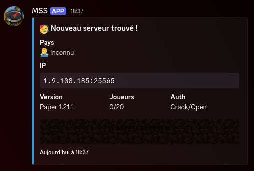

# 🌍 Minecraft Server Scanner (MSS)
MSS est un scanner réseau asynchrone ultra-rapide conçu pour découvrir des serveurs Minecraft ( Java et Bedrock ) sur l'ensemble de l'espace IP public. Il analyse l'état des serveurs, vérifie leur type d'authentification et envoie les résultats enrichis sur Discord via un Webhook.
## ✨ Fonctionnalités
- Scan Multi-Édition : Supporte les protocoles Java et Bedrock.
- Performance Asynchrone : Utilise asyncio pour gérer jusqu'à 500 connexions simultanées.
- Filtrage Géographique : Identifie le pays des serveurs grâce à la base de données GeoLite2.
- Vérification d'Authentification : Détermine si le serveur est Premium ou Cracké ( Open ).
- Génération de MOTD : Capture le "Message of the Day" HTML et le convertit en image .png.
- Système de Checkpoint : Sauvegarde la progression dans data/checkpoint.txt pour reprendre le scan automatiquement.


## 🛠️ Prérequis
Avant de lancer le script, assurez-vous d'avoir :
- Python 3.8+ installé.
- Le fichier de base de données src/GeoLite2-Country.mmdb.
- Une image de fond src/motd_bg.png pour le rendu des bannières.
- Un Webhook Discord valide.
## 🚀 Installation et Lancement
### 1. Installation des dépendances
Ouvrez un terminal et installez les librairies nécessaires :
pip install -r requirements.txt
### 2. Configuration (.env)
Créez un fichier .env à la racine du projet avec vos paramètres :
```
MC_EDITION='java'
MC_PORTS=[25565,25566]
COUNTRIES=['fr','us','be']
MIN_ONLINE=1
AUTH_TYPE='ALL'
DISCORD_WEBHOOK='votre_url_webhook'
```
### 3. Exécution par Système d'Exploitation
#### Linux (Ubuntu/Debian)
Le module html2image nécessite un navigateur pour fonctionner :
```
sudo apt update && sudo apt install -y chromium-browser
python3 main.py
```
#### Windows
Assurez-vous que Google Chrome est installé sur votre système, puis lancez :
```
python main.py
```
#### MacOSX
Ouvrez votre terminal et exécutez :
```
python3 main.py
```
## 📂 Structure des données
- data/servers.json : Historique des serveurs trouvés pour éviter les doublons.
- data/checkpoint.txt : Mémorise l'IP et le port en cours pour la reprise automatique.
- mss.log : Journal d'erreurs et suivi du scan.
## ⚠️ Avertissement
Ce projet est destiné à un usage éducatif. Le scan massif d'IP peut être restreint par votre fournisseur d'accès. Respectez les lois locales en vigueur.
# Installation de chromium
Vous allez avoir besoin d'un navigateur ( Google Chome ou Microsoft Edge ) pour sauvegarder le MOTD du serveur.
Voici un lien vers la librairie `html2image` : https://github.com/vgalin/html2image